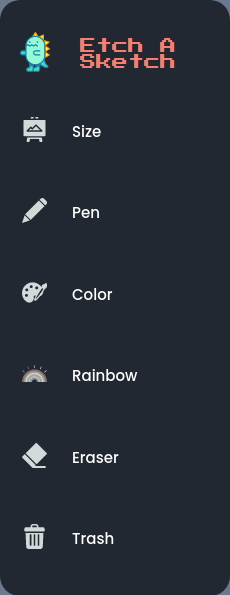
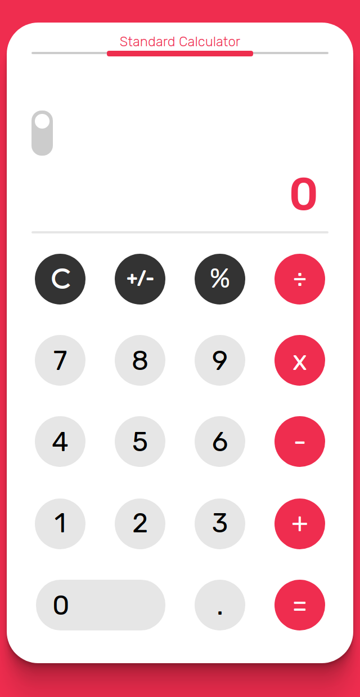
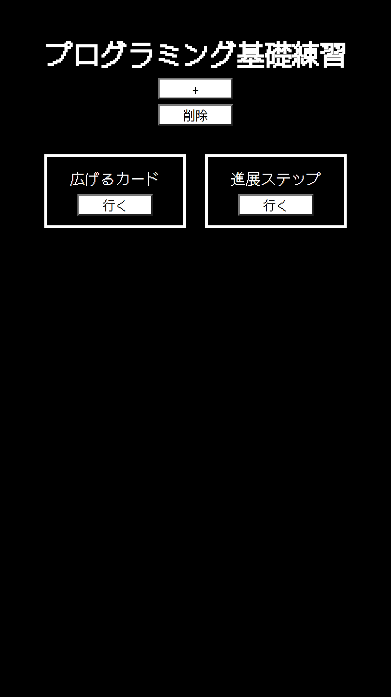
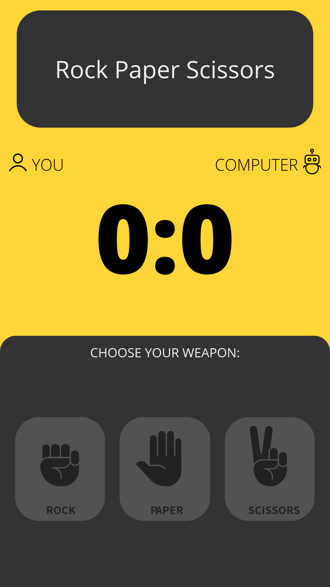

# Project Showcase

# Etch-A-Sketch


A simple webpage that let users etch a sketch.

**Link To Demo**: https://re-nanashi.github.io/etch-a-sketch/

## Description

A simple beginner webpage that was created using HTML, CSS, and Javascript. It runs renders dynamic elements according to user selection to be used as sketch or drawing canvas. Uses event listeners to inspect mouse functions to draw. This app has functions for clearing canvas, color select, eraser, canvas select, and side bar collapse. Since this a beginner project, it is made to be responsive only to few devices that uses medium to big size screens. No mobile support yet.

### Canvas Select


### Sidebar



## Development

1. Clone the project <br>
   `git clone https://github.com/re-nanashi/etch-a-sketch.git`

2. Install npm

```
npm install
```

3. Go to directory and run

# Calculator


A simple webpage calculator application

**Link To Demo**: https://re-nanashi.github.io/calculator/

## Description

A simple calculator application webpage that uses HTML, CSS, and Javascript. It runs a calculator application that has functions that is inspired from the standard iOS calculator. It is also made to be responsive to cater all devices so that all users can play no matter what device is used. Users can toggle dark mode.

### Mobile Display



## Development

1. Clone the project <br>
   `git clone https://github.com/re-nanashi/calculator.git`

2. Go the directory and run through live server

# Skiru.js


A simple project compiler webpage application.

**Link To Demo**: https://re-nanashi.github.io/skiru.jp/

## Description

A simple project compiler webpage application that is created using HTML, CSS, and JavaScript. Created to compile simple projects that I do to skill up. A simple create-read-delete application that uses localStorage to store "project cards" to compile projects.

### Mobile Display



## Development

1. Clone the project <br>
   `git clone https://github.com/re-nanashi/skiru.jp.git

2. Go the directory and run through live server

# Rock Paper Scissors Web Game


A simple webpage that let users play rock-paper-scissors against the computer.

**Link To Demo**: https://re-nanashi.github.io/rock-paper-scissors/

## Description

A simple beginner webpage that uses HTML, CSS, and Javascript. It runs a game of rock paper scrissors against a simple computer random AI. It is also made to be responsive to cater all devices so that all users can play no matter what device is used.

### Mobile Display



## Development

1. Clone the project <br>
   `git clone https://github.com/re-nanashi/rock-paper-scissors.git`

2. Go the directory and run through live server

# Space Invaders 


Play the classic Space Invaders game. This is created using the racket programming language.

**Link To Repo**: https://github.com/re-nanashi/computer-sci/tree/main/space_invaders

## Description

A simple clone of the game space invaders done using the racket programming language.

## Play

1. Download the files inside the repo

2. Run Dr. Racket IDE

3. Run the game by typing (main G0) to the Dr. Racket console

# Tetris 


Play the classic tetris game. This is created using the ruby programming language.

**Link To Repo**: https://github.com/re-nanashi/programming-languages-part-c/tree/main/week_1/tetris

## Description

A simple clone of the game tetris done using the ruby programming language.

## Play

1. Download the files inside the repo

2. Run ruby tetrisrunner.rb

# Research Presentation Material 


**Link To Material**: https://github.com/re-nanashi/Projects/blob/main/assets/Research%20Presentation.pdf

